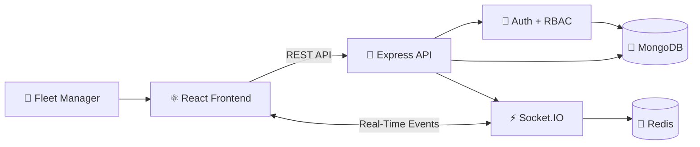
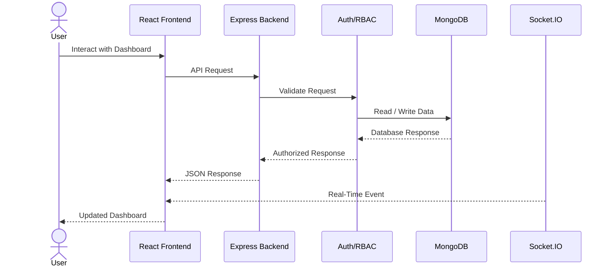
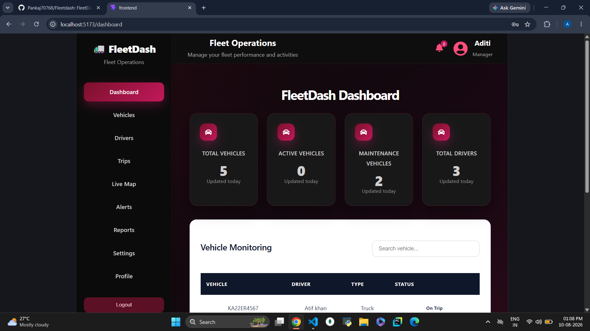
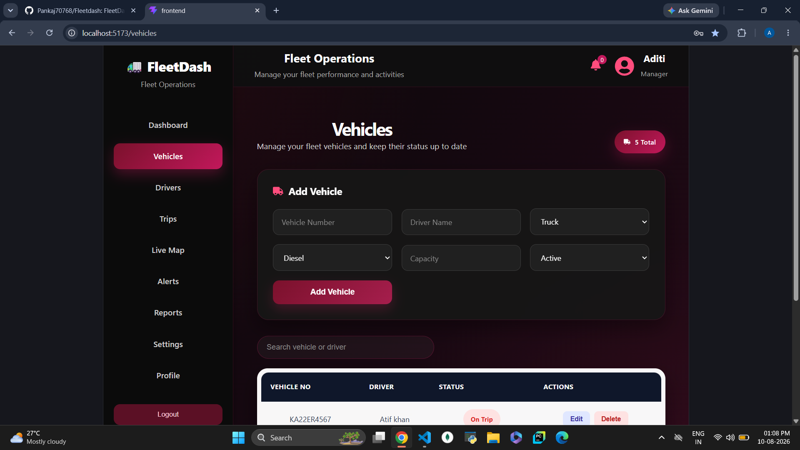
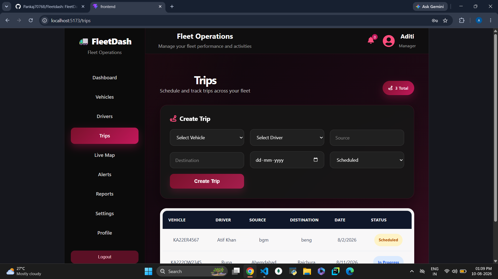

<div align="center">


<br/>


<br/><br/>

<a href="https://github.com/Pankaj70768/Fleetdash">

</a>

<a href="#-features">

</a>

<br/><br/>


</div>

---

<div align="center">

## 🚛 `Fleet Management, Reimagined.`

**FleetDash** is a full-stack fleet management platform built to bring
**vehicles, drivers, trips, alerts and real-time fleet activity** into one centralized dashboard.

<br/>

> **Track. Manage. Monitor. Move.**

</div>

---

# 🌐 Why FleetDash?

Managing a fleet means dealing with multiple moving parts at the same time.

FleetDash brings those operations together into a single system.

```text
             ┌─────────────────────────────────┐
             │          🚛 FLEETDASH            │
             │                                 │
             │   Vehicles   Drivers   Trips    │
             │      │         │        │       │
             │      └─────────┼────────┘       │
             │                │                │
             │          📊 Dashboard            │
             │                │                │
             │       ⚡ Real-Time Updates       │
             └─────────────────────────────────┘
```

### 🎯 Built to help teams

* Monitor vehicles
* Manage drivers
* Create and track trips
* Handle alerts
* Control access with roles
* Receive real-time updates
* Work with centralized fleet data

---

# ⚡ Features

<div align="center">

|  🔐 Authentication |    🚛 Vehicles   |   👨‍✈️ Drivers   |
| :----------------: | :--------------: | :---------------: |
| JWT Authentication |   Vehicle CRUD   |    Driver CRUD    |
|  Role-Based Access |  Status Tracking | Driver Management |
|  Protected Routes  | Location Support | Driver Assignment |

|      🛣️ Trips     |  ⚡ Real-Time  | 📊 Operations |
| :----------------: | :-----------: | :-----------: |
|   Trip Management  |   Socket.IO   |   Dashboard   |
| Vehicle Assignment |  Live Events  |     Alerts    |
|     Trip Status    | Fleet Updates |    Reports    |

</div>

---

# 🧠 System Overview



---

# ⚙️ Tech Stack

<div align="center">

### 🎨 Frontend


<br/><br/>

### ⚙️ Backend


<br/><br/>

### 🗄️ Database & Real-Time


<br/><br/>

### 🛠️ Development


</div>

---

# 🏗️ Project Structure

```text
Fleetdash/
│
├── 🎨 frontend/
│   │
│   ├── public/
│   ├── src/
│   │   ├── components/
│   │   ├── pages/
│   │   ├── services/
│   │   └── ...
│   │
│   ├── package.json
│   └── vite.config.js
│
├── ⚙️ backend/
│   │
│   ├── src/
│   │   ├── config/
│   │   ├── controllers/
│   │   ├── middleware/
│   │   ├── models/
│   │   ├── routes/
│   │   ├── socket/
│   │   └── utils/
│   │
│   ├── app.js
│   ├── server.js
│   ├── seed.js
│   └── simulate.js
│
├── 🗄️ Database/
│
├── .gitignore
├── package.json
└── README.md
```

---

# ⚡ Real-Time Engine

FleetDash uses **Socket.IO** to enable real-time communication between the frontend and backend.

```text
                  ⚡ REAL-TIME FLOW

      ┌───────────────┐
      │   🚛 Vehicle  │
      └───────┬───────┘
              │
              │ Event
              ▼
      ┌───────────────┐
      │  ⚡ Socket.IO │
      └───────┬───────┘
              │
              ▼
      ┌───────────────┐
      │ 🖥️ Dashboard  │
      └───────────────┘
              │
              ▼
        Instant Update
```

### Real-time capabilities include:

* Vehicle events
* Driver events
* Trip events
* Alert events
* Location-related updates
* Live frontend synchronization

---

# 🔐 Security Layer

The backend implements multiple security mechanisms:

```text
                🔐 REQUEST
                    │
                    ▼
          ┌────────────────────┐
          │ Authentication     │
          └─────────┬──────────┘
                    ▼
          ┌────────────────────┐
          │ Authorization      │
          │     / RBAC         │
          └─────────┬──────────┘
                    ▼
          ┌────────────────────┐
          │ Security Middleware│
          └─────────┬──────────┘
                    ▼
          ┌────────────────────┐
          │    Controller      │
          └─────────┬──────────┘
                    ▼
          ┌────────────────────┐
          │      MongoDB       │
          └────────────────────┘
```

### Included

* 🔑 JWT authentication
* 🔒 Password hashing
* 👮 Role-based authorization
* 🛡️ Helmet
* 🚦 Rate limiting
* 🌐 CORS
* 🔐 Environment variables
* 🛡️ Protected API routes

---

# 🔄 Application Flow



---

# 📸 Project Preview

<div align="center">

### 🖥️ Dashboard



<br/><br/>

### 🚛 Vehicle Management



<br/><br/>

### 🛣️ Trip Management



</div>

> **Replace these images with your actual screenshots.**

---

# 🚀 Getting Started

## 1. Clone

```bash
git clone https://github.com/Pankaj70768/Fleetdash.git
cd Fleetdash
```

---

## 2. Backend Setup

```bash
cd backend
npm install
```

Create your `.env` file:

```env
PORT=5000
MONGODB_URI=your_mongodb_connection
JWT_SECRET=your_secret
```

Then start the backend:

```bash
npm run dev
```

---

## 3. Frontend Setup

Open another terminal:

```bash
cd frontend
npm install
npm run dev
```

---

## 4. Seed Database

```bash
cd backend
npm run seed
```

---

## 5. Run Real-Time Simulation

```bash
npm run simulate
```

---

# 🔀 Git Workflow

FleetDash was developed using a **feature-branch + Pull Request workflow**.

```text
                       ┌───────────────┐
                       │    Feature    │
                       │    Branch     │
                       └───────┬───────┘
                               │
                               ▼
                        💻 Development
                               │
                               ▼
                         📦 Commit
                               │
                               ▼
                       🔃 Pull Request
                               │
                               ▼
                         👀 Code Review
                               │
                               ▼
                          ✅ Approval
                               │
                               ▼
                       🔀 Merge → main
```

This workflow helped keep frontend, backend, database and integration work organized across the team.

---

# 👥 The Team

<div align="center">

<table>
<tr>

<td align="center" width="33%">

## 👨‍💻 Pankaj

### Integration & Code Review

<br/>

🔍 Pull Request Reviews
🔀 Merge Management
🌿 Branch Management
🔗 Module Integration
📋 Main Branch Coordination

</td>

<td align="center" width="33%">

## 👩‍💻 Aditi

### Frontend Development

<br/>

⚛️ React Frontend
🎨 UI Development
🧭 Navigation
📊 Dashboard
⚡ Socket.IO Client
🔗 Frontend Integration

</td>

<td align="center" width="33%">

## 👨‍💻 Chakri

### Backend & Database

<br/>

🚀 Node.js / Express
🍃 MongoDB
🔌 REST APIs
🔐 Authentication
👮 Authorization
⚡ Socket.IO Backend

</td>

</tr>
</table>

</div>

---

# 📊 Project Modules

<div align="center">

```text
╭────────────────────────────────────────────────────────────╮
│                       FLEETDASH                            │
├────────────────────────────────────────────────────────────┤
│                                                            │
│  🔐 Authentication        ████████████████████  COMPLETE   │
│  👮 Authorization         ████████████████████  COMPLETE   │
│  🚛 Vehicles              ████████████████████  COMPLETE   │
│  👨‍✈️ Drivers              ████████████████████  COMPLETE   │
│  🛣️ Trips                ████████████████████  COMPLETE   │
│  📍 Location              ████████████████████  COMPLETE   │
│  🔔 Alerts                ████████████████████  COMPLETE   │
│  ⚡ Real-Time             ████████████████████  COMPLETE   │
│  🎨 Frontend              ████████████████████  COMPLETE   │
│                                                            │
╰────────────────────────────────────────────────────────────╯
```

</div>

---

# 📈 Repository Activity

<div align="center">


</div>

---

# 🐍 Contribution Activity

<div align="center">


</div>

---

# 🗺️ Roadmap

```text
                         FLEETDASH ROADMAP

                              │
                              ▼
                    ┌───────────────────┐
                    │     CORE SYSTEM   │
                    │        ✅         │
                    └─────────┬─────────┘
                              │
                              ▼
                    ┌───────────────────┐
                    │ REAL-TIME SYSTEM  │
                    │        ✅         │
                    └─────────┬─────────┘
                              │
                    ┌─────────┴─────────┐
                    ▼                   ▼
             📊 Analytics         🗺️ Tracking
               Planned              Planned
                    │                   │
                    └─────────┬─────────┘
                              ▼
                    ┌───────────────────┐
                    │  🚀 PRODUCTION    │
                    │     DEPLOYMENT    │
                    └───────────────────┘
```

### 🔮 Future Improvements

* [ ] Advanced fleet analytics
* [ ] Route optimization
* [ ] Driver performance analytics
* [ ] Advanced reporting
* [ ] Automated notifications
* [ ] Production deployment
* [ ] CI/CD pipeline
* [ ] Automated testing
* [ ] Enhanced live tracking
* [ ] Mobile application

---

# 🤝 Contributing

Want to improve FleetDash?

```bash
# Create your feature branch
git checkout -b feature/your-feature

# Make your changes
git add .

# Commit
git commit -m "Add: your feature"

# Push
git push origin feature/your-feature
```

Then open a Pull Request.

### Contribution Flow

**Fork → Branch → Build → Test → Pull Request → Review → Merge**

---

# 📜 License

This project was developed as a collaborative academic/team project.

---

<div align="center">


# 🚛 FleetDash

### `One Dashboard. Complete Fleet Control.`

<br/>


<br/><br/>

**Made with code, collaboration & a lot of GitHub commits.** ⚡

<br/>

<a href="https://github.com/Pankaj70768/Fleetdash">

</a>

</div>
